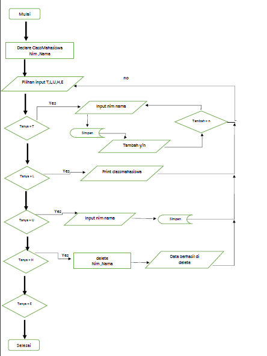
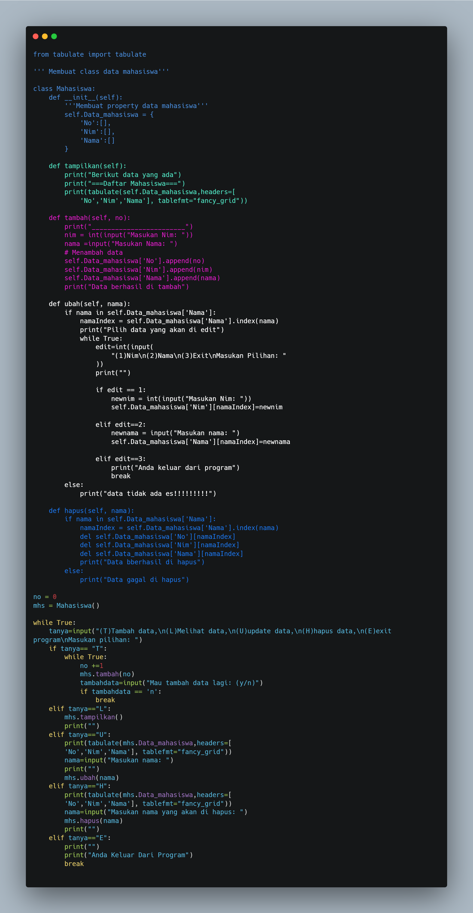

# praktikum 8 latihan oop pada python
# repository ini di buat untuk tugas bahasa pemrograman

* buat terlebih dahulu folder di vscode
* berikut flowchart program sederhana dengan clas 

 

* selanjutnya buka folder yang anda buat di vscode lalu masukan syntaks berikut dan jalankan



* berikut hasil outputnya
* jika anda memilih 
```T untuk menambah data```


* Jika anda memilih ```L untuk melihat data```


* jika anda memilih ``` U untuk update data ```


* Jika anda memilih ``` H untuk hapus data ```


* dan jika anda memilih ``` E untuk keluar dari program ```


# selesai#praktikum 8 oop
